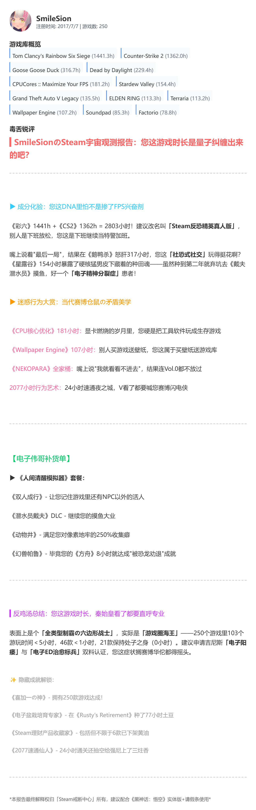

# 一款用go + html实现的Steam毒蛇锐评网页

> 有帮助的话麻烦点个⭐~

调用deepseek R1 API生成

**部署方法：**

1. 创建.env文件
2. env文件内配置STEAM_API_KEY、DEEPSEEK_API_KEY参数
3. 运行 main.go
4. localhost:9010进入网页端，输入玩家Steam数字Id即可生成锐评（R1接口响应较慢，需要多等待一会）

实现效果如图：

